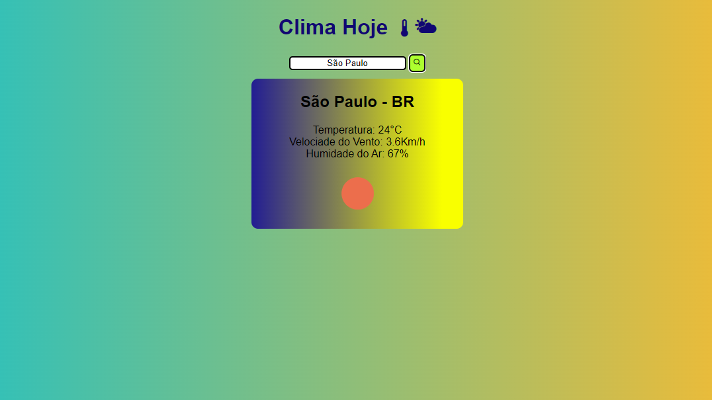

# Clima Hoje!

Projeto feito com o objetivo de verificar o clima em qualquer cidade do mundo, utilizando a API da [OpenWeather](https://openweathermap.org) disponível gratuitamente!

  <a href="#-tecnologias">Tecnologias</a>&nbsp;&nbsp;&nbsp;|&nbsp;&nbsp;&nbsp;
  <a href="#-projeto">Projeto</a>&nbsp;&nbsp;&nbsp;|&nbsp;&nbsp;&nbsp;
  <a href="#-contato">Contato</a>&nbsp;&nbsp;&nbsp;

  

 

## 🚀 Tecnologias

Esse projeto foi desenvolvido com as seguintes tecnologias:

- HTML e CSS
- JavaScript 
- Git e GitHub
- API

## 💻 Projeto

Clima Tempo feito com uso da OpenWeatherAPI.

[🔗 Clique aqui para acessar](https://rafaelrabello.github.io/Clima-Hoje/)

# 📱 Contato
rafaeluzan@live.com
